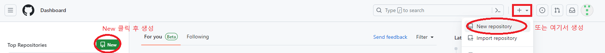
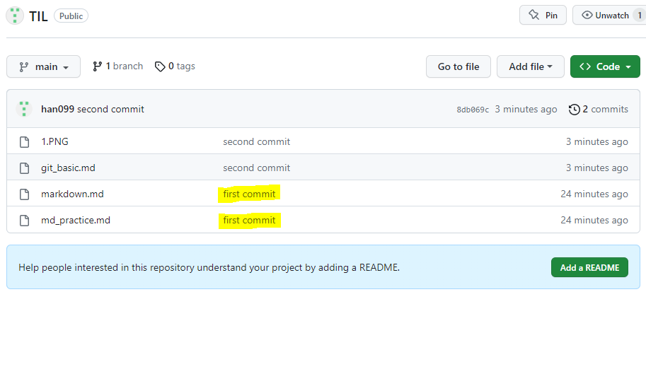

# git 정리 (8/16)
## git 기본 명령어
1. 해당 디렉토리 내에 목록보기
```git
$ ls
```
- 실행결과
```git
markdown.md  md_practice.md
```
2. 파일생성
```git
$ touch 1.txt
```
3. 파일삭제
```git
$ rm 1.txt
```
4. 폴더생성
```git
$ mkdir 1
```
5. 위치이동 ('1'이라는 이름을 가진 디렉토리로 이동)
```git
$ cd 1
```
6. 상위 폴더로 이동
```git
$ cd ..
```
7. 현재 위치 출력
```git
$ pwd
```
--- 
## git commit 연습

1.  Git 저장소 초기화
```git
$ git init
```
- 실행결과
```git
Initialized empty Git repository in C:/Users/o9912/OneDrive/바탕 화면/django/.git/ 

.git이 생성되면서 디렉토리 루트에 (main)이 추가됨
```
2. 커밋 파일 추가
```git
$ git add index.html
```
3. 파일 커밋 및 메세지추가
```git
$ git commit -m 'Add Index.html'
```
- 실행결과
```git
Author identity unknown		#계정 없음 오류

*** Please tell me who you are.			

Run

  git config --global user.email "you@example.com"
  git config --global user.name "Your Name"

to set your account's default identity.
Omit --global to set the identity only in this repository.

fatal: unable to auto-detect email address (got '사용자@DESKTOP-T56JN1L.(none)')
```
4. 사용자 계정, 이름 설정
```git
$ git config --global user.email "o99121516@gmail.com"
$ git config --global user.name "han099"   
```
5. commit
```git
$ git commit -m 'Add Index.html'
```
- 실행결과 (commit 정상 실행)
```
[main (root-commit) 19aef04] Add Index.html     
 1 file changed, 0 insertions(+), 0 deletions(-)
 create mode 100644 index.html
```
---
## github에 원격저장소 설정 후 push하기
```
$ git init
$ git add *
$ git commit -m 'first commit'
```
**브라우저에서 github로 이동 후 원격저장소 생성**

**Repository name 입력 후 Create repository**
```
$ git remote add origin (원격저장소 주소)

# https://github.com/(계정이름)/(원격저장소 이름).git
```
```
$ git push origin main
```
- 실행결과

*파일들이 잘 커밋된 것을 확인할 수 있다*


